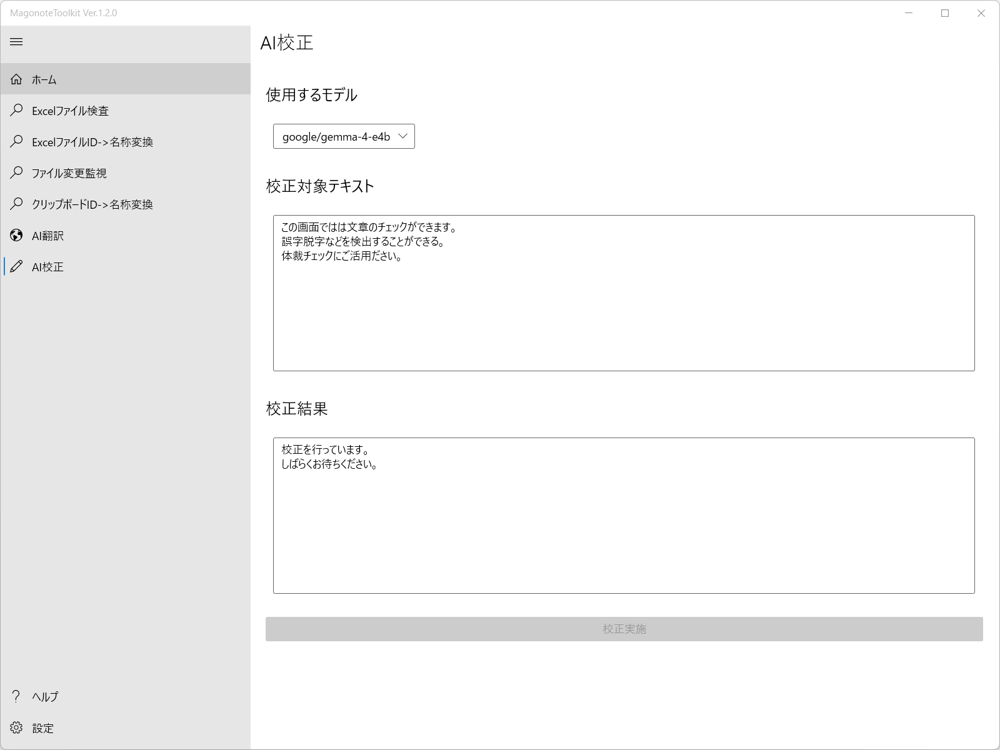
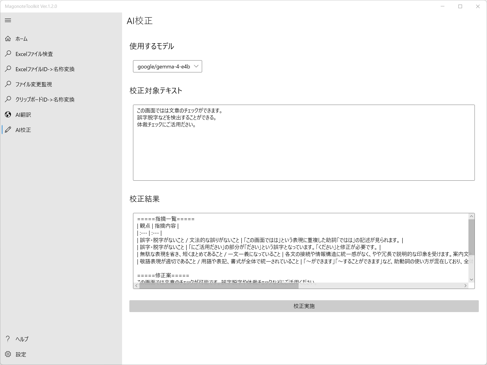

# AI校正の使い方
事前に設定画面でAI関連の設定を行ってください｡
| 設定項目 | 設定内容 |
| --- | --- |
| AIOpenAIAPIBaseUrl | OpenAI APIのベースURLを設定します｡LM StudioなどのAPIも指定可能です｡(例：http://127.0.0.1:1234/v1) |
| AIOpenAIAPIKey | OpenAI APIのAPIキーを設定します｡LM Studioなどで認証不要にしている場合は設定不要です｡ |

1. 使用するモデルを指定して､校正したいテキストを入力したあと､校正実施ボタンを押してください｡  

1. 校正結果が表示されます｡  

