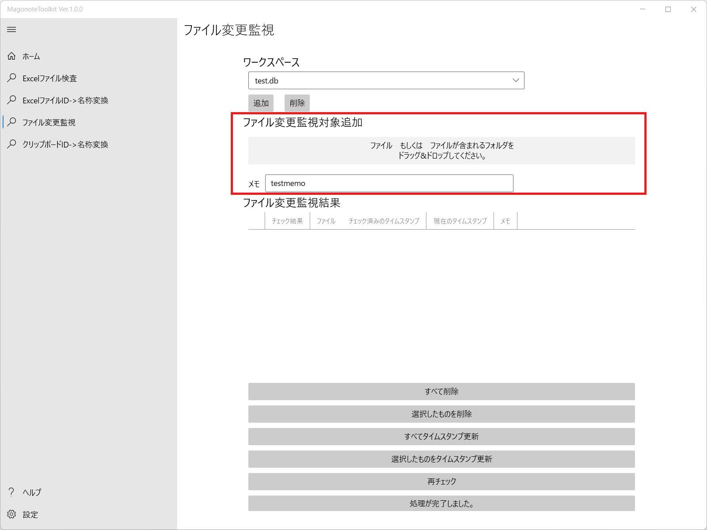

# ファイル変更監視の使い方

ファイル監視対象は｢ワークスペース｣というまとまりで管理しています｡

## ワークスペースの管理

1. ワークスペースがない場合は追加ボタンを押してワークスペースを作成してください｡

1. ワークスペースが不要になった場合はワークスペースを選択した状態で削除ボタンを押してください｡

## 監視対象の追加

1. ワークスペースを選択してください｡  

1. 必要に応じてメモを入力して､監視対象に追加したいファイルをドラッグ&ドロップしてください｡  

## 監視結果の確認

ワークスペースを選択したら確認処理が行われ､結果が表示されます｡

## 監視結果のメンテナンス

すべて削除：すべての項目を監視対象から削除します｡  
選択したものを削除：選択した項目を監視対象から削除します｡  
すべてタイムスタンプ更新：すべての項目の｢チェック済みのタイムスタンプ｣を｢現在のタイムスタンプ｣で更新します｡  
選択したものをタイムスタンプ更新：選択した項目の｢チェック済みのタイムスタンプ｣を｢現在のタイムスタンプ｣で更新します｡  
再チェック：再度チェックを行います｡  

