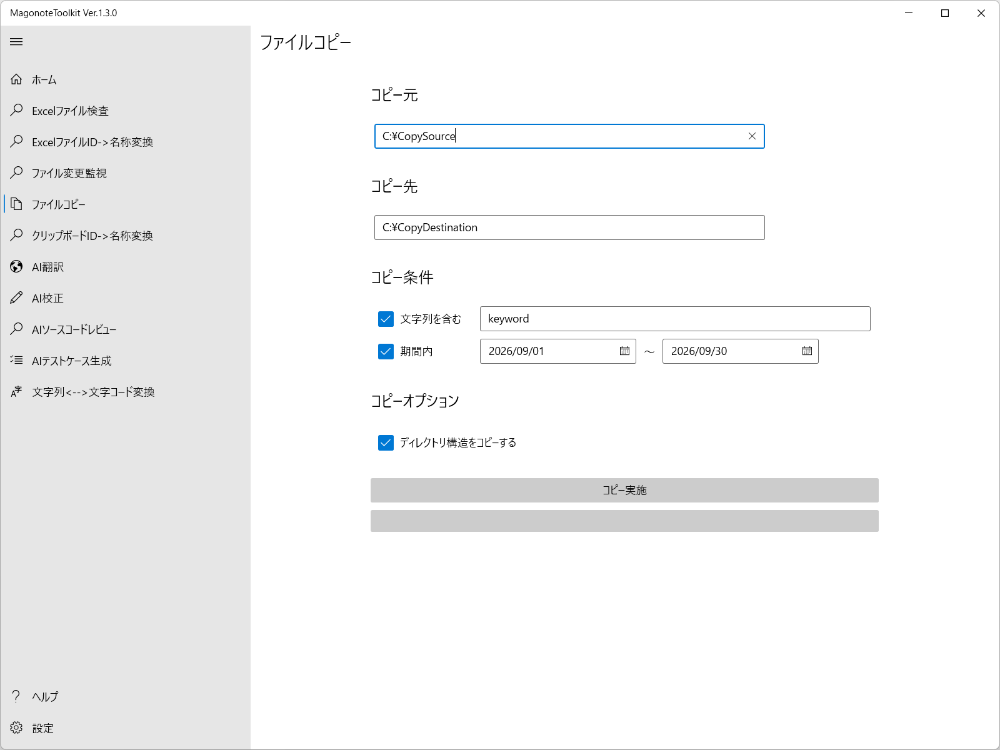

# ファイルコピーの使い方

1. 以下の通りコピーするための情報を指定してください｡
   

   | 設定項目 | 設定内容 |
   | --- | --- |
   | コピー元 | コピー元を指定してください｡ |
   | コピー先 | コピー先を指定してください｡ |
   | コピー条件：文字列を含む | パスの中に特定の文字列を含む場合のみコピーする場合はチェックを入れてキーワードを指定してください｡ |
   | コピー条件：期間内 | ファイルの更新日時が期間内の場合のみコピーする場合はチェックを入れて期間を指定してください｡ |
   | コピーオプション：ディレクトリ構造をコピーする | コピー元のディレクトリ構造のままコピーする場合はチェックを入れてください｡チェックを外すとファイルがコピー先の直下に格納されます｡ |

1. コピー実施ボタンを押してください｡結果は進捗バーに表示されます｡
